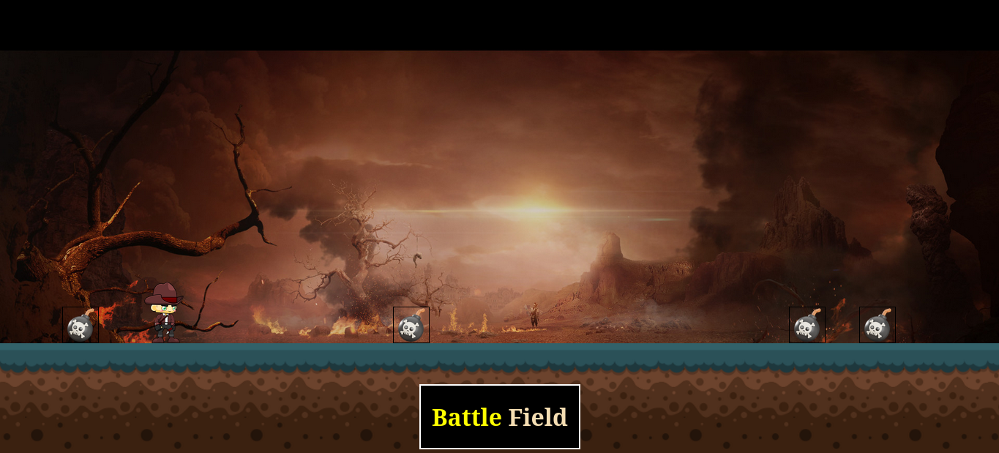

# Battle Field

Battle Field browser based mini game developed by me to enhance my CSS and JavaScript knwoledge.

## How to play

- Open this game via browser from [Battle Field](https://sandarubc.github.io/mini-game/).
- Use left arrow key to navigate **left**, Use right arrow key to navigate **right**.
- Use space bar to **Jump**.
- In order to win you need to complete two cycles of runs without touching bombs.

## Technologies Used

 - HTML
 - SCSS
 - JavaScript

## How to clone this repository

- Open terminal in desired location.
- Enter following command in terminal and press enter

`git clone https://github.com/sandarubc/mini-game.git`

### Contact

Linkedin @ [Sandaru Akalanka](https://www.linkedin.com/in/sandaru-akalanka-464776188/)

Github @ [Sandarubc](https://github.com/sandarubc)